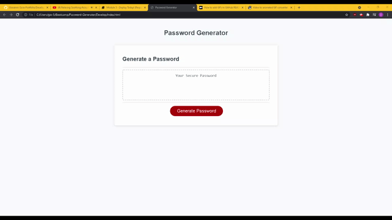

# JS Password-Generator
Webpage that generates random passwords based on JavaScript

## Description
This assignment utilized javascript to create an application that generates a random password, based on prompted selections. The structure of the HTML, CSS, and javascript sheets provided needed adjustments, mostly on javascript. The password that is generated prompts whether to display any numeric, lower, upper, and special characters. 

### Completed Tasks
* HTML and CSS files were provided\
* Created function GeneratePassword 
* create a range and limitations so that a numeric 8-128 character password is generated
* Created five variables that stores whether to include any upper case , lower case, numeric, or special characters via confirm window
* The collection of variables in for loop generated password randomly.

#### Link
![Link to Deployed Website] (https://gisosa531.github.io/Password-Generator/Develop/index.html)

![link to GitHub Repository] (https://github.com/gisosa531/Password-Generator)

#### References
*  [https://www.w3schools.com/js/](https://www.w3schools.com/js/)
*  [https://www.freecodecamp.org/news/how-to-use-javascript-collections-map-and-set/](https://www.freecodecamp.org/news/how-to-use-javascript-collections-map-and-set/)
* [https://javascript.info/](https://javascript.info/)

### Images

